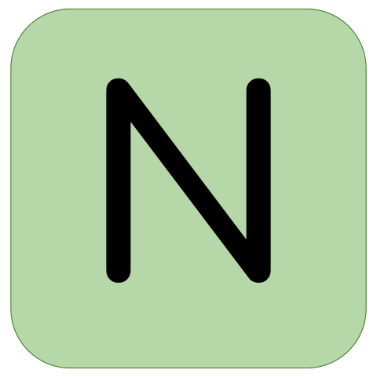
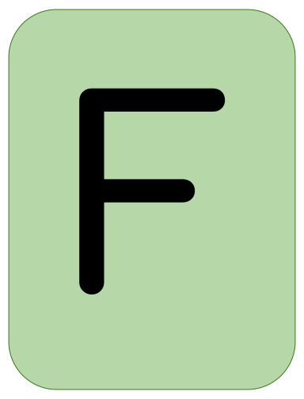
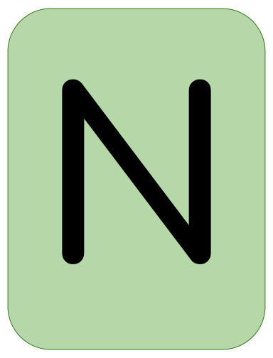

Hi! 👋🏼 I'm Jordan, welcome to my github!

📨 jordanbott.dev@gmail.com <br/>
🗓️ [Meet with me!](https://calendly.com/jordanbott-dev/30min?back=1&month=2024-02) <br/>
📝 Check out my <a href="./Jordan%20Bott%20Resume.pdf" target="_blank">resume</a>! <br/>


<!--START_SECTION:waka-->

```txt
From: 04 March 2024 - To: 11 March 2024

Total Time: 11 hrs 56 mins

Python       9 hrs 18 mins   ███████████████████▒░░░░░   77.84 %
Markdown     1 hr 5 mins     ██▒░░░░░░░░░░░░░░░░░░░░░░   09.07 %
YAML         56 mins         ██░░░░░░░░░░░░░░░░░░░░░░░   07.84 %
XML          19 mins         ▓░░░░░░░░░░░░░░░░░░░░░░░░   02.67 %
Text         5 mins          ▒░░░░░░░░░░░░░░░░░░░░░░░░   00.81 %
```

<!--END_SECTION:waka-->

Let's play wordle! Everyone is welcome to participate!

We won! 🎉 The word was: FINCH

Click "start a new game" to play again!

[START A NEW GAME](https://github.com/jordan-bott/jordan-bott/issues/new?assignees=&labels=&projects=&template=wordle_guess.md&title=wordleguess%7C%5BPUT+5+LETTER+WORD+HERE%5D)

Most Recent Player: [jordan-bott](https://github.com/jordan-bott)

| Current Game | Letters |
| ------------ | ------- |
| <br/><br/><br/><br/> | <br /><br /> |

Do you love stats? Check out these:
[PLAYER STATS](./wordle/stat_sheets/PlayerData.md)   [GLOBAL STATS](./wordle/stat_sheets/GlobalData.md)

