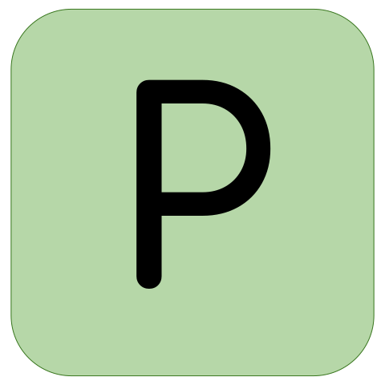
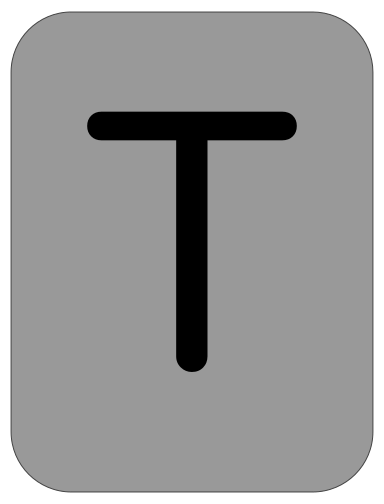
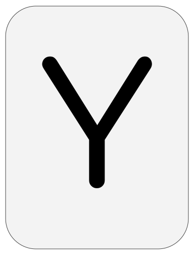
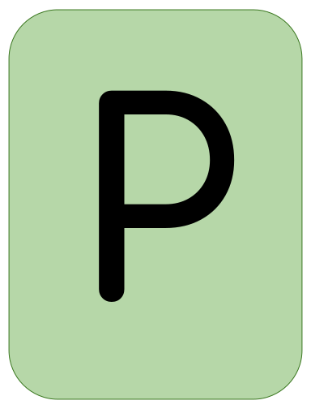

Hi! 👋🏼 I'm Jordan, welcome to my github!

📨 jordanbott.dev@gmail.com <br/>
🗓️ [Meet with me!](https://calendly.com/jordanbott-dev/30min?back=1&month=2024-02) <br/>
📝 Check out my <a href="./Jordan%20Bott%20Resume.pdf" target="_blank">resume</a>! <br/>


<!--START_SECTION:waka-->

```txt
From: 05 March 2024 - To: 12 March 2024

Total Time: 16 hrs 19 mins

Python       10 hrs 23 mins  ████████████████░░░░░░░░░   63.62 %
Markdown     4 hrs 10 mins   ██████▒░░░░░░░░░░░░░░░░░░   25.55 %
YAML         1 hr 8 mins     █▓░░░░░░░░░░░░░░░░░░░░░░░   06.97 %
XML          19 mins         ▒░░░░░░░░░░░░░░░░░░░░░░░░   01.96 %
Text         5 mins          ░░░░░░░░░░░░░░░░░░░░░░░░░   00.59 %
```

<!--END_SECTION:waka-->

# Let's Play 

     

> [!TIP]
> Everyone is welcome to participate! This is an **asynchronous**, and **collaborative** version of wordle, where players make one move at a time. Please make as many or as few moves as you would like!

Click "make a guess" below to contribute. ⬇️

[](https://github.com/jordan-bott/jordan-bott/issues/new?assignees=&labels=&projects=&template=wordle_guess.md&title=wordleguess%7C%5BPUT+5+LETTER+WORD+HERE%5D)

🧑‍💻 Most Recent Player: &ensp; [](https://github.com/jordan-bott)

| Current Game | Letters |
| ------------ | ------- |
| <br/> | <br /><br /> |

Do you love stats? Check out these: &ensp; [](./wordle/stat_sheets/PlayerData.md) &nbsp;  [](./wordle/stat_sheets/GlobalData.md)
