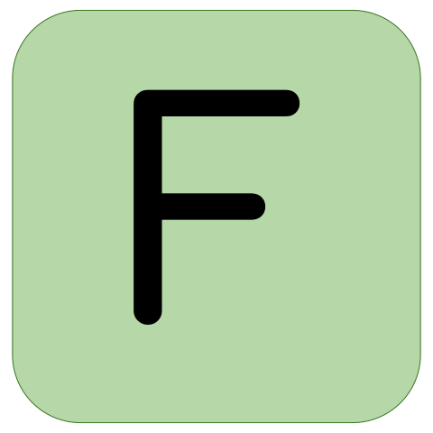

Hi! 👋🏼 I'm Jordan, welcome to my github!

📨 jordanbott.dev@gmail.com <br/>
🗓️ [Meet with me!](https://calendly.com/jordanbott-dev/30min?back=1&month=2024-02) <br/>
📝 Check out my <a href="./Jordan%20Bott%20Resume.pdf" target="_blank">resume</a>! <br/>


<!--START_SECTION:waka-->

```txt
Markdown     5 mins          ██████████████▓░░░░░░░░░░   58.69 %
YAML         2 mins          ██████▒░░░░░░░░░░░░░░░░░░   25.59 %
JavaScript   1 min           ████░░░░░░░░░░░░░░░░░░░░░   15.72 %
```

<!--END_SECTION:waka-->

Let's play wordle! Everyone is welcome to participate!

We won! 🎉 The word was: FRAME

Click "start a new game" to play again!

[START A NEW GAME](https://github.com/jordan-bott/jordan-bott/issues/new?assignees=&labels=&projects=&template=wordle_guess.md&title=wordleguess%7C%5BPUT+5+LETTER+WORD+HERE%5D)

<br/><br/>

