Hi! 👋🏼 I'm Jordan, welcome to my github!

📨 jordanbott.dev@gmail.com <br/>
🗓️ [Meet with me!](https://calendly.com/jordanbott-dev/30min?back=1&month=2024-02) <br/>
📝 Check out my <a href="./Jordan%20Bott%20Resume.pdf" target="_blank">resume</a>! <br/>


<!--START_SECTION:waka-->

```txt
From: 04 December 2024 - To: 03 January 2025

Total Time: 14 hrs 1 min

JavaScript   10 hrs 35 mins  ███████████████████░░░░░░   75.53 %
Python       3 hrs 17 mins   ██████░░░░░░░░░░░░░░░░░░░   23.42 %
CSS          8 mins          ▒░░░░░░░░░░░░░░░░░░░░░░░░   01.03 %
Other        0 secs          ░░░░░░░░░░░░░░░░░░░░░░░░░   00.01 %
Git          0 secs          ░░░░░░░░░░░░░░░░░░░░░░░░░   00.01 %
```

<!--END_SECTION:waka-->

# Let's Play 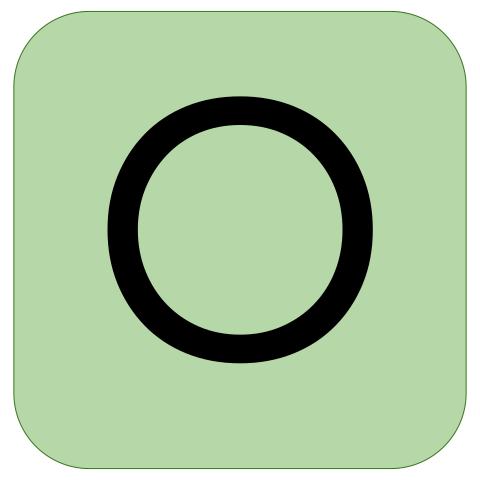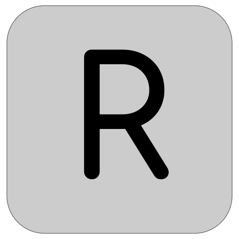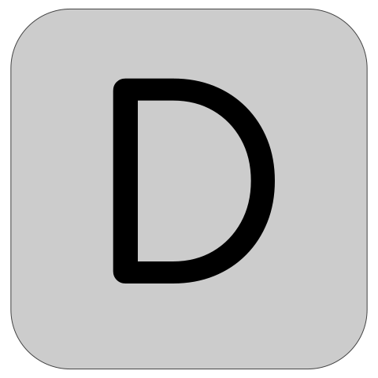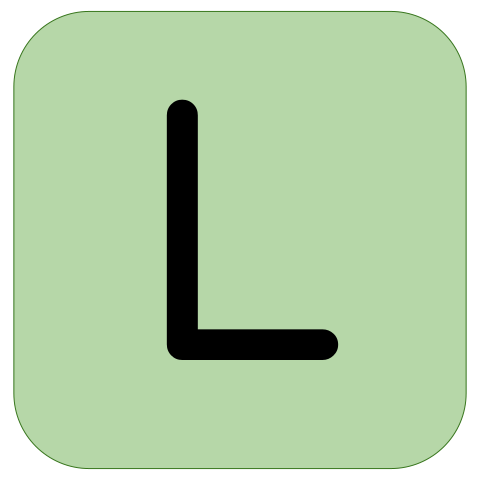

     

> [!TIP]
> Everyone is welcome to participate! This is a **collaborative** version of wordle, where players make one move at a time in a shared game. Please make as many or as few moves as you would like!

Is this your first time here? Check out &ensp; [](./wordle/HowToPlay.md)

Click "make a guess" below to contribute. ⬇️

[](https://github.com/jordan-bott/jordan-bott/issues/new?assignees=&labels=&projects=&template=wordle_guess.md&title=wordleguess%7C%5BPUT+5+LETTER+WORD+HERE%5D)

🧑‍💻 Most Recent Player: &ensp; [](https://github.com/jordan-bott)

| Current Game | Letters |
| ------------ | ------- |
| 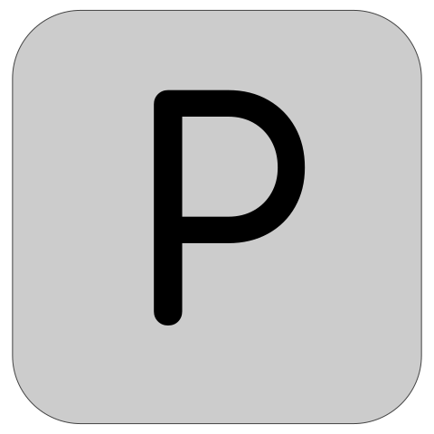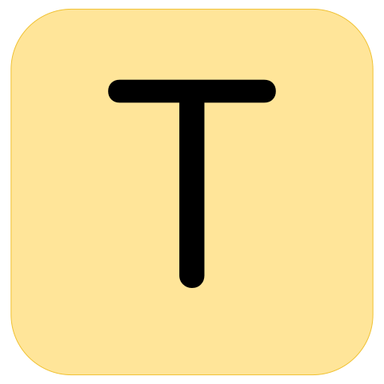<br/>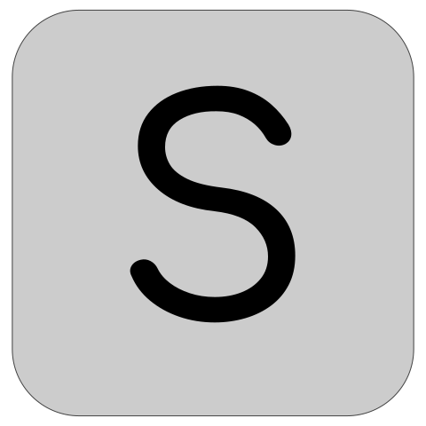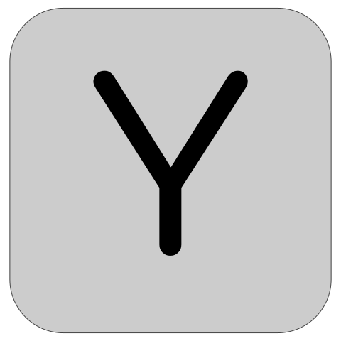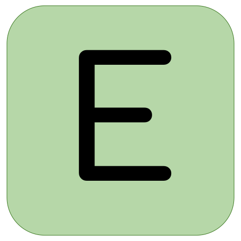<br/> | 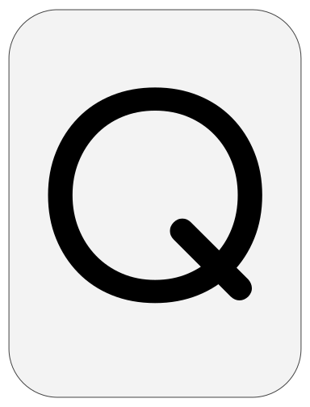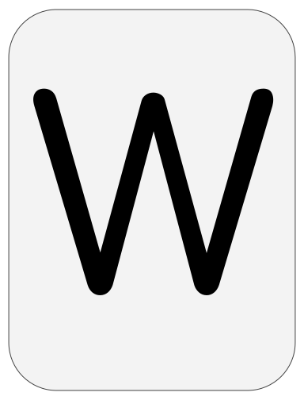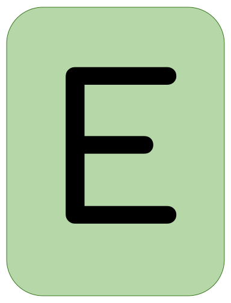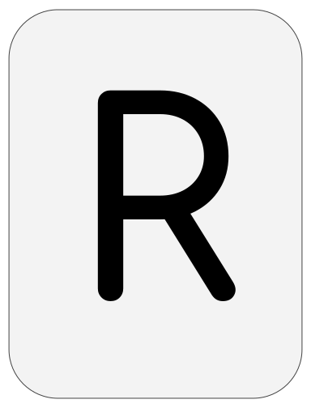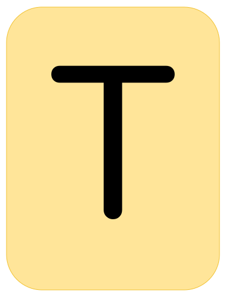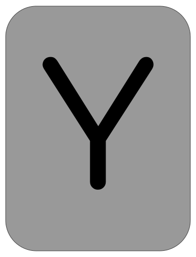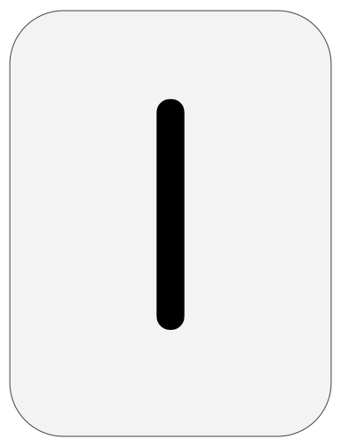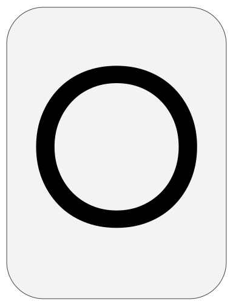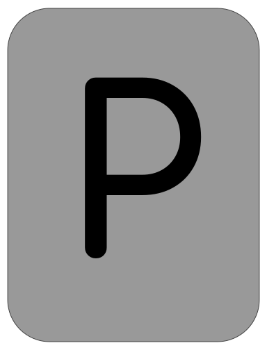<br /> &ensp;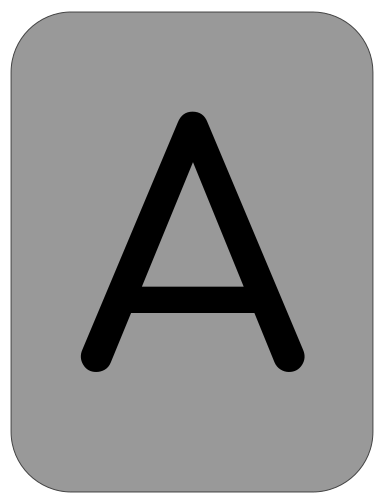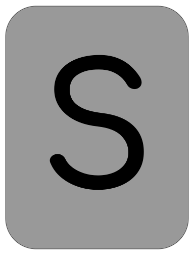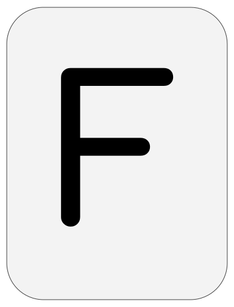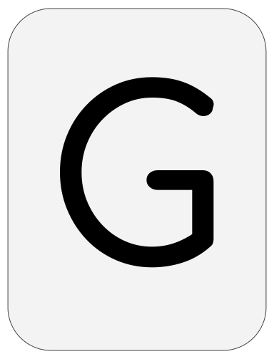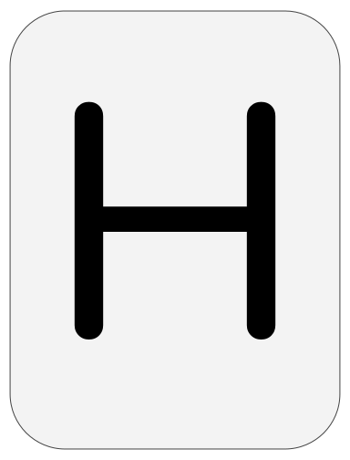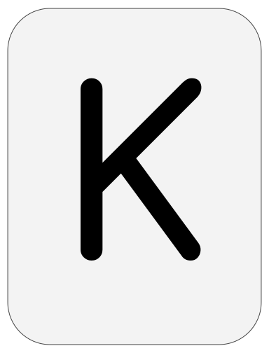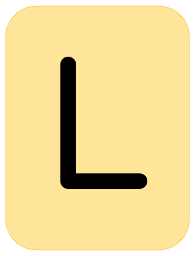<br /> &ensp; &thinsp; &thinsp;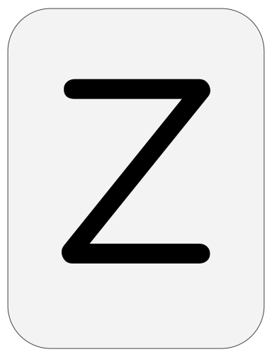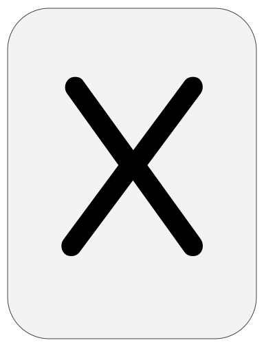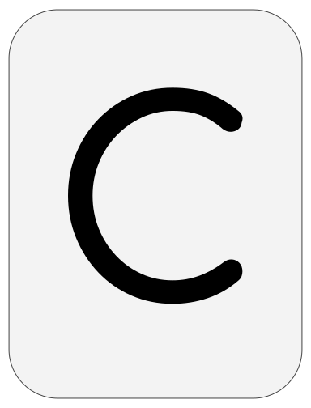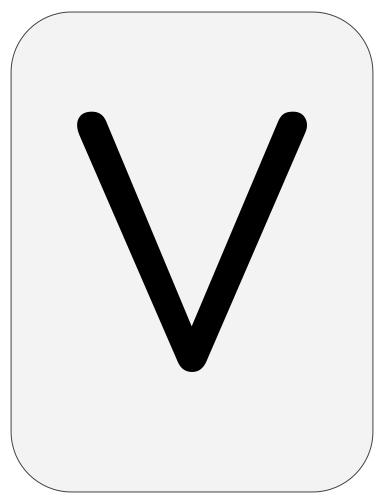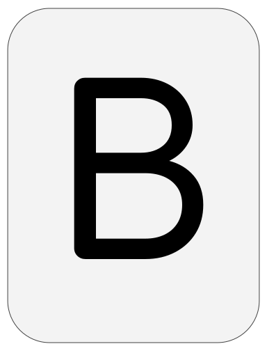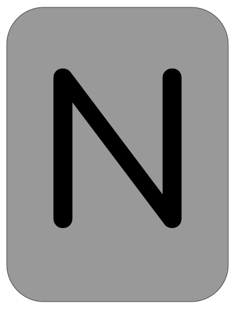 |

Do you love stats? Check out these: &ensp; [](./wordle/stat_sheets/PlayerData.md) &nbsp;  [](./wordle/stat_sheets/GlobalData.md)

Curious how everything is working? Check out the &ensp; [](./wordle/README.md)

