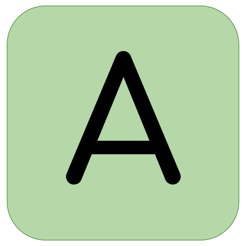
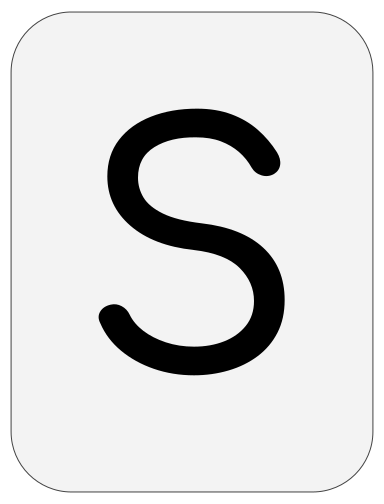

Hi! 👋🏼 I'm Jordan, welcome to my github!

📨 jordanbott.dev@gmail.com <br/>
🗓️ [Meet with me!](https://calendly.com/jordanbott-dev/30min?back=1&month=2024-02) <br/>
📝 Check out my <a href="./Jordan%20Bott%20Resume.pdf" target="_blank">resume</a>! <br/>


<!--START_SECTION:waka-->

```txt
Python       2 hrs 39 mins   ███████████████▓░░░░░░░░░   62.88 %
Markdown     47 mins         ████▓░░░░░░░░░░░░░░░░░░░░   18.71 %
YAML         31 mins         ███░░░░░░░░░░░░░░░░░░░░░░   12.46 %
Text         4 mins          ▒░░░░░░░░░░░░░░░░░░░░░░░░   01.66 %
XML          3 mins          ▒░░░░░░░░░░░░░░░░░░░░░░░░   01.57 %
```

<!--END_SECTION:waka-->

Let's play wordle! Everyone is welcome to participate!

Click "make a guess" below to contribute.

The game is on guess # 2

[MAKE A GUESS](https://github.com/jordan-bott/jordan-bott/issues/new?assignees=&labels=&projects=&template=wordle_guess.md&title=wordleguess%7C%5BPUT+5+LETTER+WORD+HERE%5D)

| Current Game | Letters |
| ------------ | ------- |
| <br/><br/> | <br /><br /> |

Do you love stats? Check out these below:
[PLAYER STATS](./wordle/stat_sheets/PlayerData.md)   [GLOBAL STATS](./wordle/stat_sheets/GlobalData.md)

