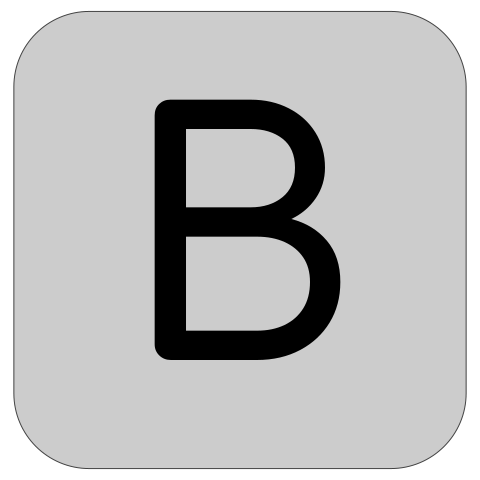
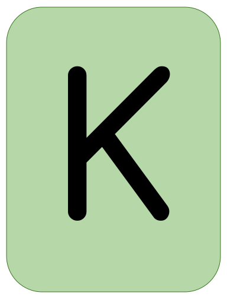
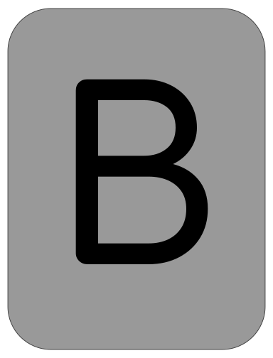

Hi! 👋🏼 I'm Jordan, welcome to my github!

📨 jordanbott.dev@gmail.com  
🗓️ [Meet with me!](https://calendly.com/jordanbott-dev/30min?back=1&month=2024-02)  
📠Check out my <a href="./Jordan%20Bott%20Resume.pdf" target="_blank">resume</a>!  

<!--START_SECTION:waka-->
<!--END_SECTION:waka-->

# Let's play 

     

> [!TIP]
> Everyone is welcome to participate! This is an **asynchronous**, and **collaborative** version of wordle, where players make one move at a time. Please make as many or as few moves as you would like!

We won! 🎉 The word was: CHICK

Click "start a new game" to play again! ⬇️

🧑‍💻 Most Recent Player:  &ensp; 

| Current Game | Letters |
| ------------ | ------- |
|       |    |

Do you love stats? Check out these: &ensp;  &nbsp;  

