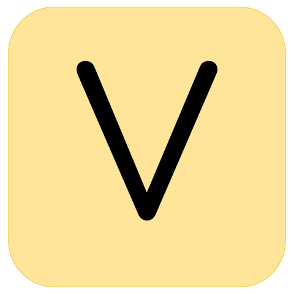
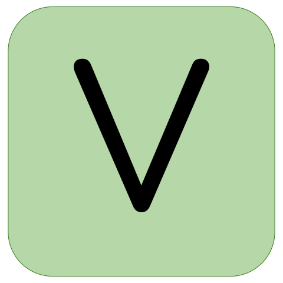
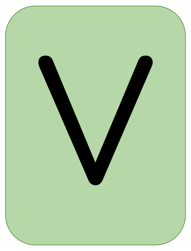

Hi! 👋🏼 I'm Jordan, welcome to my github!

📨 jordanbott.dev@gmail.com <br/>
🗓️ [Meet with me!](https://calendly.com/jordanbott-dev/30min?back=1&month=2024-02) <br/>
📝 Check out my <a href="./Jordan%20Bott%20Resume.pdf" target="_blank">resume</a>! <br/>


<!--START_SECTION:waka-->

```txt
From: 06 March 2024 - To: 13 March 2024

Total Time: 20 hrs 52 mins

Python       13 hrs 23 mins  ████████████████░░░░░░░░░   64.13 %
Markdown     5 hrs 32 mins   ██████▓░░░░░░░░░░░░░░░░░░   26.53 %
YAML         1 hr 18 mins    █▓░░░░░░░░░░░░░░░░░░░░░░░   06.30 %
XML          19 mins         ▒░░░░░░░░░░░░░░░░░░░░░░░░   01.53 %
Text         6 mins          ░░░░░░░░░░░░░░░░░░░░░░░░░   00.49 %
```

<!--END_SECTION:waka-->

# Let's play 

     

> [!TIP]
> Everyone is welcome to participate! This is an **asynchronous**, and **collaborative** version of wordle, where players make one move at a time. Please make as many or as few moves as you would like!

We won! 🎉 The word was: HOVER

Click "start a new game" to play again! ⬇️

[](https://github.com/jordan-bott/jordan-bott/issues/new?assignees=&labels=&projects=&template=wordle_guess.md&title=wordleguess%7C%5BPUT+5+LETTER+WORD+HERE%5D)

🧑‍💻 Most Recent Player:  &ensp; [](https://github.com/JohnathanNiles)


| Current Game | Letters |
| ------------ | ------- |
| <br/><br/><br/> | <br /><br /> |

Do you love stats? Check out these: &ensp; [](./wordle/stat_sheets/PlayerData.md) &nbsp;  [](./wordle/stat_sheets/GlobalData.md)

