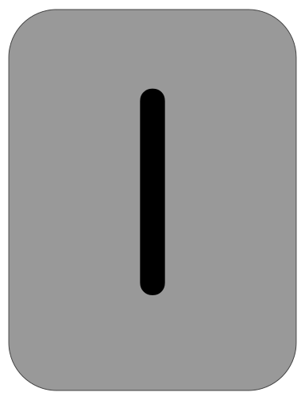
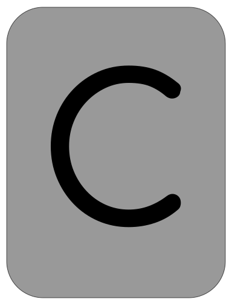

Hi! 👋🏼 I'm Jordan, welcome to my github!

📨 jordanbott.dev@gmail.com <br/>
🗓️ [Meet with me!](https://calendly.com/jordanbott-dev/30min?back=1&month=2024-02) <br/>
📝 Check out my <a href="./Jordan%20Bott%20Resume.pdf" target="_blank">resume</a>! <br/>


<!--START_SECTION:waka-->

```txt
From: 07 March 2024 - To: 14 March 2024

Total Time: 24 hrs 14 mins

Python       13 hrs 54 mins  ██████████████▒░░░░░░░░░░   57.37 %
Markdown     8 hrs 22 mins   ████████▓░░░░░░░░░░░░░░░░   34.56 %
YAML         1 hr 19 mins    █▒░░░░░░░░░░░░░░░░░░░░░░░   05.45 %
XML          19 mins         ▒░░░░░░░░░░░░░░░░░░░░░░░░   01.32 %
Text         6 mins          ░░░░░░░░░░░░░░░░░░░░░░░░░   00.42 %
```

<!--END_SECTION:waka-->

# Let's play 

     

> [!TIP]
> Everyone is welcome to participate! This is a **collaborative** version of wordle, where players make one move at a time in a shared game. Please make as many or as few moves as you would like!

Is this your first time here? Check out &ensp; [](./wordle/HowToPlay.md)

We won! 🎉 The word was: GLOSS

Click "start a new game" to play again! ⬇️

[](https://github.com/jordan-bott/jordan-bott/issues/new?assignees=&labels=&projects=&template=wordle_guess.md&title=wordleguess%7C%5BPUT+5+LETTER+WORD+HERE%5D)

🧑‍💻 Most Recent Player:  &ensp; [](https://github.com/thejoshchow)


| Current Game | Letters |
| ------------ | ------- |
| <br/><br/><br/><br/> | <br /><br /> |

Do you love stats? Check out these: &ensp; [](./wordle/stat_sheets/PlayerData.md) &nbsp;  [](./wordle/stat_sheets/GlobalData.md)

Curious how everything is working? Check out the &ensp; [](./wordle/README.md)

