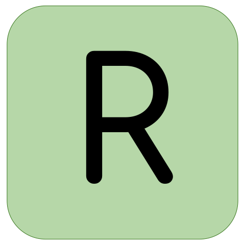

Hi! 👋🏼 I'm Jordan, welcome to my github!

📨 jordanbott.dev@gmail.com  
🗓️ [Meet with me!](https://calendly.com/jordanbott-dev/30min?back=1&month=2024-02)  
📠Check out my <a href="./Jordan%20Bott%20Resume.pdf" target="_blank">resume</a>!  

<!--START_SECTION:waka-->
<!--END_SECTION:waka-->

# Let's Play Wordle!

Everyone is welcome to participate! This is an **asynchronous**, and **collaborative** version of wordle, where players make one move at a time. Please make as many or as few moves as you would like!

Click "make a guess" below to contribute.

[MAKE A GUESS](https://github.com/jordan-bott/jordan-bott/issues/new?assignees=&labels=&projects=&template=wordle_guess.md&title=wordleguess%7C%5BPUT+5+LETTER+WORD+HERE%5D)

Most Recent Player: [emilyvictany](https://github.com/emilyvictany)

| Current Game | Letters |
| ------------ | ------- |
|     |    |

Do you love stats? Check out these:
[PLAYER STATS](./wordle/stat_sheets/PlayerData.md)   [GLOBAL STATS](./wordle/stat_sheets/GlobalData.md)

