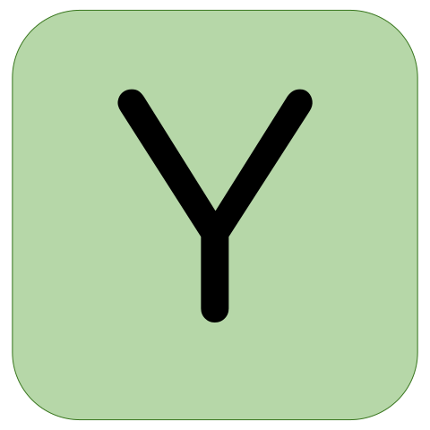

# Welcome to  !


[!IMPORTANT]
> If you have played the [NYT version](https://www.nytimes.com/games/wordle/index.html) of Wordle, this game has a few key differences. Please check out the [Special Rules](#special-rules)!
> If you've never played the NYT version of Wordle you are also in the right place! Keep reading.

## Typical Wordle Rules

The game of Wordle is relatively simple. The premise of the game is to try to guess a random 5 letter word in 6 guesses or less. Each time you make a guess, the game will provide you with some information about your guess.

🟩 -> a green tile means you have the correct letter, in the correct position!

🟨 -> a yellow tile means you have a letter that appears in the word, but it's not in the right spot.

⬛️ -> a gray tile means that this letter does not appear in the word anywhere

### Here's an example:

Let's say the wordle word is `SPLAT`, and you guess `PLANT`. Here is what the guess will look like:


So, here's what we know:

- There is a `P` `L` and `A` in the word, but not in the first, second or third spot respectively.
- There is no `N` in the word
- There is a `T` in the 5th spot.

From here you would take the information you've learned from `PLANT` and make another guess. You can choose to follow all of the information you have gained (it is all true), or you can guess a word that uses entirely different letters to try to get more information, it's entirely up to you! As long as it meets all of the valid word criteria found in [Special Rules](#special-rules).

That's the basic premise of Wordle! At this point, you are basically ready to play. There are a few special rules that apply to my version of Wordle specifically and can be found in [Special Rules](#special-rules) below!

## Tricky Cases

### -> What happens when you guess a word that has multiple of the same letter?

Let's say the word is `GROWL` and we guess the word `BULLY`. Here's what that guess will look like:


In this case there _is_ an `L` in the wordle word (in the 5th spot), but we guessed a word with `L` in the 3rd and 4th spot. The game will show _both_ `L` as yellow, to show you that the `L` is not found in either spot we guessed. **This does not necessarily mean there are _2_ `L` in the word**.

Let's say the word is `APPLE` and we guess `SILLY`. Here's what that guess will look like:


In this case, our guess still has 2 `L`, however we have correctly found the location of 1 of the `L`, and there **is not** 2 `L` in the guess. So, the `L` that is in the wrong location will display as gray, while the correct `L` (4th position) will display as green.

Let's say the word is `BELLY` and we guess `HOLLY`. Here's what that guess will look like:



In this case our guess, `HOLLY` has 2 `L`, and the word, `BELLY` also has 2 `L` in the same location. So in this case, it will display both `L` as green.

### -> What happens when a wordle word has multiple of the same letter?

Let's say the word is `HAPPY` and we guess `ELOPE`. Here's what that guess would look like:


In this case, we found the correct location for _one_ of the `P` in `HAPPY` (the 4th position). However, the game gives no indication if that is the **_only_** instance of that letter. You'll have to make your best guess for that one!

Let's say the word is `SKILL` and we guess `LABEL`. Here's what that guess would look like:


In this case, one `L` in `LABEL` (first position) is yellow, and the other `L` (5th position) is green. This means there is _at least_ 2 `L` in the Wordle word - one in the 5th position, and one in the 2nd, 3rd or 4th position.


## Special Rules

In this version of Wordle, we play **collaboratively**. Here's what's different:

- Games are played as a community! Everyone that comes to this page is seeing the exact same game, and share all of the guesses (i.e. there is one, and only one shared instance of the game! We're all working together.). Please make as many or as few guesses as you would like! And participate in as many or as few games as you would like.
    - NOTE: there are still just 6 tries to guess the Wordle Word!
- To make a guess click on the "MAKE A GUESS" button, or if the game is over click on "START A NEW GAME"
    - This will take you to a GitHub issue template where you will submit your guess (so you **must** be signed into GitHub to participate, sorry!).
    - Insert your guess in the _title_ of the issue where it says [PUT 5 LETTER WORD HERE]
        - Your title should look something like this:

        ```
        wordleguess|[plant]
        ```

        - Make sure to place your guess _inside_ the brackets.
        - Do not change anything else about the title.
    - Guesses **_must_** follow these guidelines:
        - Professional / respectful / appropriate words. There is a list of "banned" words, and your guess won't go through if it's not professional, respectful, and appropriate.
        - Must be *exactly* 5 letters
        - Cannot have been guessed already in this game
        - Must be an actual word found in the dictionary
- New games are generated as soon as one game is over! Unlike the NYT wordle, there are unlimited games per day.


That's it! All other rules about game play remain the same. If you have any questions about how it works, please feel free to shoot me an email [jordanbott.dev@gmail.com](jordanbott.dev@gmail.com)
